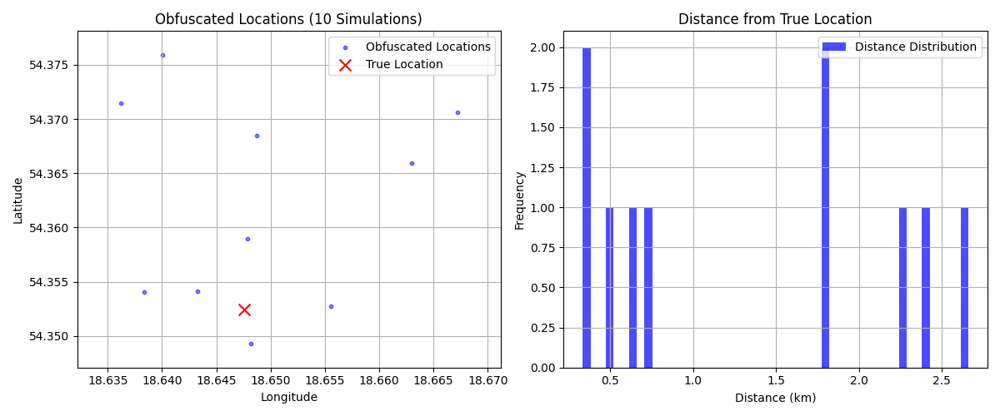
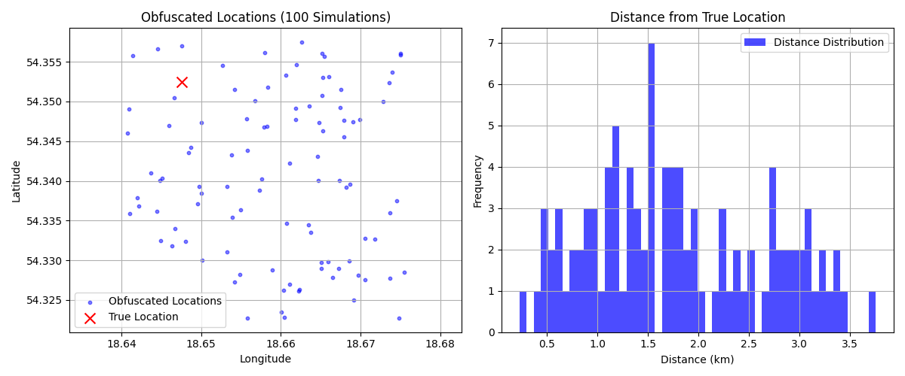
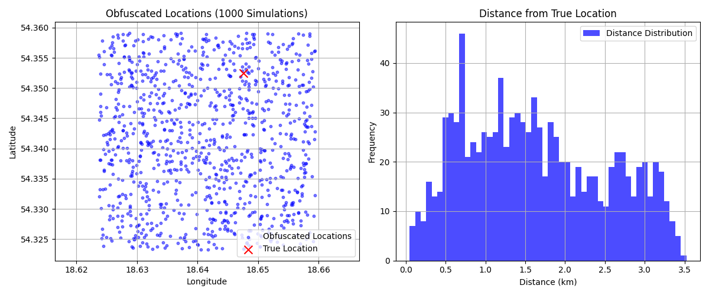
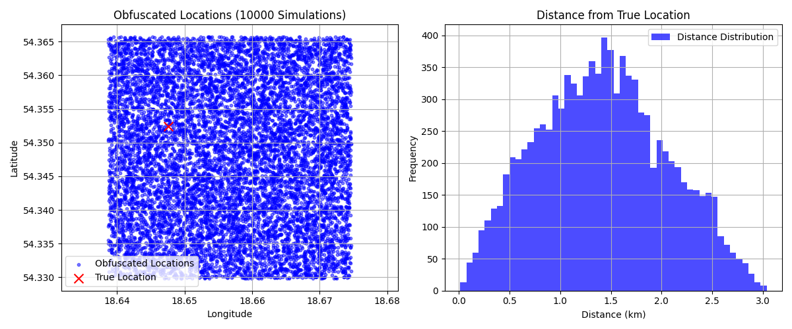
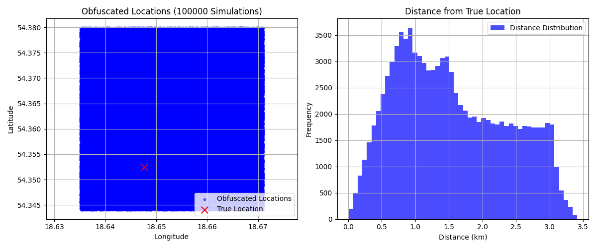

# Location Obfuscation Simulator
## Overview
This repository contains a Python script to simulate location obfuscation, a technique used to protect user privacy by generating "dummy" locations around a true geographic position. The simulation applies a deterministic offset (based on a private key) and a random jump within a square area, then visualizes the results using scatter plots and histograms.

## What This Code Does

`Input`: A true location `latitude` and `longitude`, a `private key`, and a square area size `initial_side_km`. 

`Process`: 
- Generates a private key to seed a deterministic pseudo-random number generator (PRNG). 
- Applies a deterministic offset to the true location using the PRNG.
- Adds a random jump within a square area (default: 2 km side length) using NumPy’s random number generator. 
- Repeats the process for a specified number of simulations (default: 10000).

`Output`: 
- A scatter plot showing the true location `(red 'x')` and obfuscated locations `(blue dots)`. 
- A histogram showing the distribution of distances from the true location to the obfuscated locations. 
- The plots are saved as a `PNG file` named `simulation<private_key>.png`.

## Purpose
This simulation helps analyze the effectiveness of the obfuscation algorithm by visualizing how far obfuscated locations are from the true location and their distribution.

## Requirements
To run this simulation, you need:

`Python 3.x`: Tested with Python 3.12+

`NumPy`: For numerical computations and random number generation.

`Matplotlib`: For plotting the scatter plot and histogram.

### Install the dependencies using pip:
~~~
pip install numpy matplotlib
~~~

### How to Run

Clone the Repository:
~~~
git clone https://github.com/OtterPeer/location-obfuscation-simulator.git
cd location-obfuscation-simulator
~~~

### Run the Simulation
~~~
python simulate_obfuscation.py
~~~

### View the Output:
The script will generate a PNG file named simulation<private_key>.png `(e.g., simulation123456789.png)`. Open the PNG file to see the scatter plot and histogram.

## Customization

`True Location`: Modify `true_lat` and `true_lon` in the script to change the starting location (default: 54.352448, 18.647599).
`Number of Simulations`: Adjust `n_simulations` to run more or fewer simulations (default: 100,000).
`Square Area Size`: Change `initial_side_km` to adjust the size of the random jump area (default: 2 km).

## Usage in OtterPeer App

This simulation script is derived from the geolocation obfuscation logic implemented in the OtterPeer app, specifically under the OP-56-Geolocation branch of the repository: https://github.com/OtterPeer/otter-peer/tree/OP-56-Geolocation. It mirrors the dummyLocation, privateKeyToOffset, and randomPointInSquare functions used in the app to generate privacy-preserving dummy locations. The simulation helps validate and visualize the obfuscation algorithm's behavior, ensuring it effectively protects user privacy while maintaining proximity-based functionality in the OtterPeer app.

## Example Output

`Scatter Plot`: Shows the true location (red 'x') and 100,000 obfuscated locations (blue dots) on a longitude-latitude plane.

`Histogram`: Displays the distribution of distances (in kilometers) from the true location to each obfuscated location, typically showing a range up to 2-3 km based on the obfuscation parameters.

## Screenshots
Key: 206870185653917794, N Request Simulation: 10

Key: 707881251296153671, N Request Simulation: 100

Key: 282825279414208989, N Request Simulation: 1000

Key: 834234639947268848, N Request Simulation: 10000

Key: 565101062142011159, N Request Simulation: 100000
